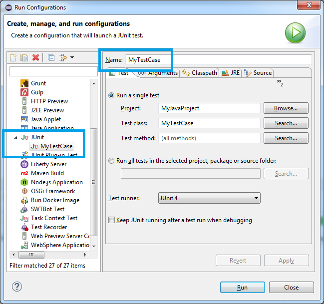

# Auto Junit Test Rerunner

Automatically rerun JUnit tests in your Eclipse workbench until a failure occurs. This can be used to debug tests that only fail intermittently, or to judge how intermittently tests are failing.

## Installation

In order to install this plug-in, you can either download this JAR file into the (eclipse install)/dropins/ directory of your Eclipse install:
* http://jgw-www.mybluemix.net/auto-junit-test-rerunner/AutoJunitTestRerunnerUpdateSite-1.3.1-SNAPSHOT.zip

Or you can install from this update site (Select Help > Install New Software > Add > Location, and paste this URL):
* http://jgw-www.mybluemix.net/auto-junit-test-rerunner/

## Usage

To begin running an automated JUnit test in your workspace, click the Eclipse icon in the toolbar. This will open a new dialog. Results of testing will appear in the "Auto JUnit Test Rerunner" view: 

## You may run an automated JUnit test with the following options:

**Test Name Substring**: A string that matches (only) one of the names of one of your JUnit launch configurations. See below for details.

**Time to wait between test launches**: After a test completes successfully, how long to wait before launching that test again. A recommended value is around 15-30 seconds. If your machine is slow, or overloaded, you should increase the value (or decrease if you have no issues). If you are seeing workbench errors when a test is relaunched, increase this value. An example of an error that would indicate this value should be increased is the 'Workbench is already in use' launch error.

**Keep trying after fail, and record fail %**: If this value is true, we will keep launching the test over and over again, even after it fails. You can then look at the statistics in the Auto Junit view, to see what the failure % of your test suite is. If this value is false, once a test in a test suite has failed, we will not-auto relaunch.

**Open dialog immediately on test case fail**: As soon as a test fails, open a dialog and attempt to grab window focus. This will alert you that a test has failed (flashing window in task bar), if you have the test utility running in the background.

**Run tests w/ Eclipse Debug mode**: If true, tests will run in DEBUG mode (and breakpoints in tests will trigger as normal). If false, tests will run in RUN mode.

## What is Test Name Substring?

Test name substring refers to the _name of the launch configuration_, not the name of the classes of the test case/test suite. That is, you should already have an Eclipse JUnit/JUnit plug-in Launch Configuration defined for your test (if you are running junit tests in your workbench, you already have one). Just enter either full or substring of the name of the launch configuration. For example, specify 'MyTestCase' to match a launch configuration called 'MyTestCase'. Value is case-insensitive. Don't worry, an error will be thrown if there are 0 or >= 2 matches. 

